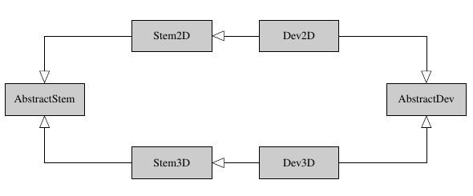

Dev data objects
================

Basically, a signal processing algorithm development aims at testing some method on synthetic (i.e. noise-free) data that has been manually degraded. As the truth image is known, metrics can be computed to test and compare the method.

To that end, two data objects :class:`~.dev.Dev2D` and :class:`~.dev.Dev3D` have been developed. These are children classes from :class:`~.signals.Stem2D` and :class:`~.signals.Stem3D` (themselves are children of the basic data structure :class:`~.signals.AbstractStem`).

    A simple UML diagram.

These objects basically work as non-dev data objects: 

* they are initialized with data and a Scan object,
* loading them can be done with the same functions as for non-dev data,
* they can be corrected with a configuration file,
* they can be reconstructed using the basic :meth:`~.signals.AbstractStem.restore` of :class:`~.signals.AbstractStem`,
* they can be plotted with the same tools.

Their difference is that:

* noise can be added,
* the results are reproducible,
* new noise can be drawn whenever you want,
* the :class:`~.dev.Dev3D` allows you to consider the PCA-transformed data as the base data (this is useful for developing 3D restoration algorithm).

Initialize Dev data
-------------------

Manually
~~~~~~~~

The Dev data objects could be initialized manually with the same arguments as for :class:`~.signals.Stem2D` and :class:`~.signals.Stem3D` classes, i.e.:

* :code:`hsdata`, :code:`scan` and :code:`verbose` for :class:`~.signals.Stem2D`,
* :code:`hsdata`, :code:`scan`, :code:`PCA_transform`, :code:`PCA_th` and :code:`verbose` for :class:`~.signals.Stem3D`,

In addition to these arguments, a required input is :code:`key` which is a small descriptive keyword to help referencing. Other optional inputs are:

* :code:`modif_file`: an configuration file which is sent to correction function,
* :code:`sigma`: the desired noise standard deviation in case additional noise is desired, 
* :code:`seed`: the noise seed to have reproducible data,
* :code:`normalized`: if set to True, the data are normalized at initialization.

.. code-block:: python

    >>> stem2d_data = inpystem.load_key('HR-sample', 2)
    Reading configuration file ...
    Generating data ...
    Creating STEM acquisition...
    Correcting STEM acquisition...
    >>> scan_shape = stem2d_data.scan.shape
    >>> scan = inpystem.Scan.random(shape=scan_shape, ratio=0.5)
    >>> dev_data = inpystem.Dev2D('my-dev-data', hsdata=stem2d_data.hsdata, scan=scan, sigma=0.5, seed=0)
    Creating STEM acquisition...
    >>> dev_data
    <Dev2D, title: HR-sample, dimensions: (|113, 63), sampling ratio: 0.50>

With load functions
~~~~~~~~~~~~~~~~~~~

The :func:`~.dataset.load_file` and :func:`~.dataset.load_key` functions also enable to load development data. To that end, the user just has to use the :code:`dev` input which is a dictionary. This dictionary should store the desired inputs:

* for 2D data: :code:`modif_file`, :code:`sigma`, :code:`seed` and :code:`normalized`
* for 2D data: :code:`PCA_transform`, :code:`PCA_th`, :code:`modif_file`, :code:`sigma`, :code:`seed` and :code:`normalized`

.. code-block:: python

    >>> dev = {'sigma': 0.5, 'seed': 0}
    >>> inpystem.load_key('HR-sample', 2, dev=dev, scan_ratio=0.5, scan_seed=1)
    Reading configuration file ...
    Generating data ...
    Creating STEM acquisition...
    Correcting STEM acquisition...
    <Dev2D, title: HR-sample, dimensions: (|113, 63), sampling ratio: 0.50>

Note that in case the development data is loaded, the key would be the name of the :code:`.conf` file (e.g. for :code:`my-conf-file.conf`, the key would be :code:`my-conf-file`).

Some words about data storage
-----------------------------

Contrary to Stem2D and Stem3D objects, development objects work with numpy techniques (to generate the noise, add it, perform PCA) so that this is the central data to be stored in Dev objects.

More precisely, the data are stored twice or three times under the attributes:

* :attr:`~.dev.Dev2D.data` which stores the noise-free data,
* :attr:`~.dev.Dev2D.ndata` which stores the noisy data (in case :attr:`~.dev.AbstractDev.sigma` is None and no noise-corruption procedure was applied, this attribute is None),
* :attr:`~.dev.Dev2D.hsdata` which stores the data as an HyperSpy data.

The last attribute only exist to send the data into restoration procedures. To display noisy or noise-free data, prefer the two first attributes.

Reproducibility and noise
-------------------------

Inside the data creation procedure, the random effects can come from the scan generation (in case of random initialization) or from the noise generation. For both situations, the seed can be set to get reproducible results. Indeed, the scan seed can be set in the load functions with its :code:`scan_seed` parameter or directly calling the :meth:`~.signals.Scan.random` with its :code:`seed` parameter. The noise seed can be set itself with the :attr:`~.dev.Dev2D.seed` attribute.

.. caution:: The seed values are set for the **startup** procedures. When this is set for the :class:`~.dev.Dev2D` class, this seed is set just before drawing the noise matrix **for the first time**. If the user wants to draw another noise matrix, the seed will not be the same any more. This is the same for the random scans.

To generate a new noise matrix, just use the :meth:`~.dev.Dev2D.set_ndata`. To generate a new random scan, just re-run the :meth:`~.signals.Scan.random` method without the :code:`seed` argument.

How PCA works for :class:`~.dev.Dev3D`
--------------------------------------

At the :class:`~.signals.Stem3D` initialization, the 3D data are fully stored as an HyperSpy data. When the user wants to reconstruct the data, the usual :code:`PCA_transform` and :code:`PCA_th` arguments can given. This is passed into the reconstruction algorithms which perform PCA as pre and post-processing steps.

In the case of the :class:`~.dev.Dev3D` class, these parameters are given at initialization. If :attr:`~.dev.Dev3D.PCA_transform` is False, then the full data is stored into the :attr:`~.dev.Dev3D.data` attribute. The user could choose to perform PCA by giving :code:`PCA_transform` into the :meth:`~.dev.Dev3D.restore` as an argument.

.. code-block:: python

    >>> dev = {'sigma': 0.5, 'PCA_transform': False}
    >>> data = inpystem.load_key('HR-sample', 3, dev=dev)
    Reading configuration file ...
    Generating data ...
    Creating STEM acquisition...
    Correcting STEM acquisition...

    >>> data.data.shape
    (63, 115, 1510)

    >>> outdata, info = data.restore()
    Restoring the 3D STEM acquisition...
    -- Interpolation reconstruction algorithm --
    - PCA transformation -
    Dimension reduced from 1510 to 4.
    Estimated sigma^2 is 2.76e-01.
    Done in 1.27s.
    -
    Done in 0.05s.
    ---

    >>> info['PCA_info']['H'].shape  # The PCA basis used for restoration
    (1510, 4)

In the case of True :attr:`~.dev.Dev3D.PCA_transform` at initialization, a PCA procedure is executed at initialization and the :attr:`~.dev.Dev3D.data` (and possibly :attr:`~.dev.Dev3D.ndata`) data are reduced in the last axis direction. Additional information is stored in the :attr:`~.dev.Dev3D.PCA_info` attribute. In such case, the user should use the :meth:`~.dev.Dev3D.restore` method without giving the :code:`PCA_transform` argument.

.. code-block:: python

    >>> dev = {'sigma': 0.5, 'PCA_transform': True}
    >>> data = inpystem.load_key('HR-sample', 3, dev=dev)
    Reading configuration file ...
    Generating data ...
    Creating STEM acquisition...
    Correcting STEM acquisition...
    - PCA transformation -
    Dimension reduced from 1510 to 290.
    Estimated sigma^2 is 1.43e+03.
    Done in 1.27s.
    -

    >>> outdata, info = data.restore()
    Restoring the 3D STEM acquisition...
    -- Interpolation reconstruction algorithm --
    Done in 11.12s.
    ---

    >>> 'PCA_info' in info
    False

.. note:: The default behavior for the :meth:`~.dev.Dev3D.restore` :code:`PCA_transform` argument is to take the logical not of the :code:`PCA_transform` argument given at initialization. If the :class:`~.dev.Dev3D` class has been initialized without PCA, then a PCA is applied by default before restoration. If PCA has been required at initialization, then no PCA will be applied at restoration.

    Yet, the user can explicitly ask for additional PCA (which is stupid, I agree) or for no PCA at all. Let's explain it clearly: **if you don't want PCA, say it at initialization and at restoration**.

.. caution:: The two examples above show something important as the estimated PCA threshold is 3 in the case where :code:`PCA_transform` is not given at initialization and 290 otherwise. This means that both orders do not have the same effects.

    If :code:`PCA_transform` is True at initialization, the PCA transformation is performed **before** adding noise so that the signal is clear enough to have a high threshold. Besides, the noise is added **to the data in PCA space**.

    If :code:`PCA_transform` is False at initialization but True at restoration, the noise is added to the full dimension data. Besides, the PCA is applied to *noised* data so that few principle components get more powerful than noise and the threshold drops.

To handle easily direct and inverse PCA transformations, two methods are given: :meth:`~.dev.Dev3D.direct_transform` and :meth:`~.dev.Dev3D.inverse_transform`. They both allow the user to **perform the same PCA direct/inverse transformation as for the :class:`~.dev.Dev3D` initialization method**. These methods accept HyperSpy as numpy data.

These methods incorporate also normalization procedure inside. This means that the :meth:`~.dev.Dev3D.direct_transform` method performs also centering and normalization whereas the :meth:`~.dev.Dev3D.inverse_transform` inject the standard deviation and the mean back.

.. code-block:: python
    
    >>> import inpystem
    
    # Case with non-PCA-initialized object
    >>> dev = {'sigma': 0.5, 'PCA_transform': False, 'normalize': False}
    >>> data = inpystem.load_key('HR-sample', 3, dev=dev)
    >>> direct_data = data.direct_transform(data.data)  # Performing direct transformation to data
    >>> inverse_data = data.inverse_transform(data.data)  # Performing inverse transformation to data
    >>> import numpy.testing as npt  # This is to check arrays are equal
    >>> npt.assert_allclose(data.data, direct_data)  # Equal
    >>> npt.assert_allclose(data.data, inverse_data)  # Equal

    >>> dev = {'sigma': 0.5, 'PCA_transform': False}  # Non-normalized here
    >>> data = inpystem.load_key('HR-sample', 3, dev=dev)
    >>> direct_data = data.direct_transform(data.data)
    >>> inverse_data = data.inverse_transform(direct_data)
    >>> npt.assert_allclose(data.data, direct_data)  # Error because of normalization
    >>> npt.assert_allclose(data.data, inverse_data)  # Equal: direct, then inverse is identity :)

    # Case with PCA-initialized object
    >>> dev = {'sigma': 0.5, 'PCA_transform': True}
    >>> data = inpystem.load_key('HR-sample', 3, dev=dev)
    >>> inverse_data = data.inverse_transform(data.data)
    >>> direct_data = data.direct_transform(inverse_data)
    >>> npt.assert_allclose(data.data, direct_data)  # Equal: direct, then inverse is still identity :)

    >>> data.data.shape  # PCA shape
    (63, 115, 290)
    >>> inverse_data.shape  # True image shape
    (63, 115, 1510)
    >>> direct_data.shape  # PCA shape
    (63, 115, 290)

One word about visualization
----------------------------

The development data visualization works as for non-dev classes. Yet, development data visualization methods accept an additional argument which is :code:`noised`. This optional argument that is False by default sets which data should be displayed (noise-free data by default or noisy data).