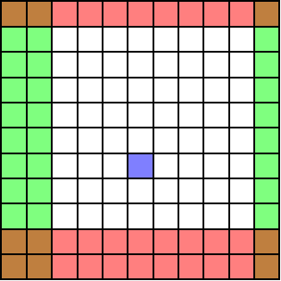

Correcting data
===============

Introduction
------------

Sometimes, you can face a situation where your data has outliers, i.e. data that are abnormal because of local dysfunctions. The data *were* acquired, but their value are *not* normal. In such case, you can wish to

* purely remove columns / rows / bands,
* correct particular dead pixels by replacing their value by correct ones.

For the dead pixels, their new value are set to a mean over the nearest correct sampled positions. 

In the below example, the user wants to remove the red rows, the green columns and correct a dead pixel in blue.

    Correction with a single image

Correcting data manually
------------------------

This is realized easily by using the :meth:`~.signals.AbstractStem.correct` method of the data object. This only requires 

* slices objects that define the rows and columns to keep (and the bands in case of 3D data),
* the position of dead pixels.

.. note:: Let us recall what a :code:`slice` object is. When you define a numpy array :code:`A` of shape :code:`(m, n)`, you can access columns and rows using e.g. :code:`A[1:2:5, :2]`. In each direction, you specify the start, stop and step values.

    For example, writing :code:`A[1:, :]` mean you want to select all rows from row 1 to the last row :code:`m`. This is equivalent to write :code:`A[slice(1), :]`. In fact, a :code:`slice` object just defines, for a direction, the start, stop and step values. Let's have some examples:

    * :code:`1:` is equivalent to :code:`slice(1)`,
    * :code:`:10` is equivalent to :code:`slice(None, 10)`,
    * :code:`::10` is equivalent to :code:`slice(None, None, 10)`,
    * :code:`2:10` is equivalent to :code:`slice(2, 10)`,
    * :code:`:` is equivalent to :code:`slice(None)`.

For the above example, one should write the following code.

.. code-block:: python

    >>> data
    <Stem3D, title: Test, dimensions: (|11, 11), sampling ratio: 0.20>
    >>> data.correct(rows=slice(1, 9), columns=slice(2, 10), dpixels=[6*11+5])
    Correcting STEM acquisition...

    >>> data
    <Stem3D, title: Test, dimensions: (|8, 8), sampling ratio: 0.20>

Correcting data with the configuration file
-------------------------------------------

A lot of information can be given to inpystem through the configuration file. To pass correction info to the load functions, all you need is to define slices inside the corresponding :code:`2D DATA` or :code:`3D DATA` sections. For this, use the following keys: :code:`rows`, :code:`columns`, :code:`bands` and :code:`dpixels`. The slice should be written as for numpy array selection (:code:`1:-60`). Let's illustrate is with the configuration file of the HR-sample example image.

.. code-block:: ini

    [2D DATA]
    file = spim4-2-df-manualy aligned image.dm4
    columns = 15:-60
    dpixels = [9384, 8468]

    [3D DATA]
    file = spim4-2_ali.dm4
    columns = 15:-60
    bands = 90:
    dpixels = [9384, 8468]

.. note:: Contrary to the :meth:`~.signals.AbstractStem.correct` method which allows slices, the configuration files require literal slices such as :code:`1:-50`.
    
    One other main difference is that slices objects *do not accept negative values* while the configuration files values are parsed and *accept negative values*. As a consequence, to tell inpystem you just want to keep all rows but the first one and the five last ones, you should write :code:`slice(1:m-1)` (where :code:`m` is the number of rows) for the :meth:`~.signals.AbstractStem.correct` method while the configuration file would accept :code:`1:-5`.

